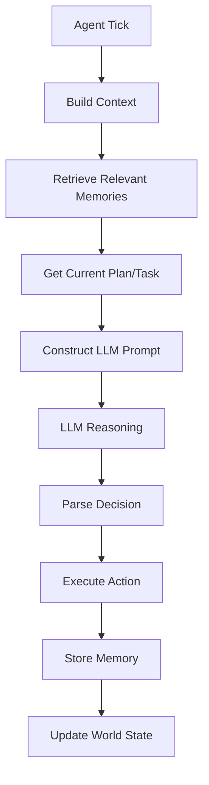
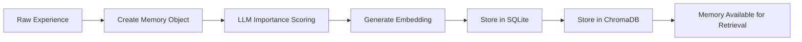

# Agent Cognitive Architecture

Deep technical documentation of the cognitive systems that power our AI agents: memory formation, reflection generation, autonomous planning, and LLM-powered decision making.

## 🧠 Overview

Our agents implement a sophisticated cognitive architecture that mirrors aspects of human cognition while leveraging the power of Large Language Models. The system consists of four interconnected cognitive engines:

```
┌─────────────────────────────────────────┐
│            Agent Cognitive Stack        │
├─────────────────────────────────────────┤
│  🧠 LLM Cognition Engine                │
│     • Natural language reasoning        │
│     • Context-aware decision making     │
│     • Personality-driven responses      │
├─────────────────────────────────────────┤
│  💾 Memory Manager                      │
│     • Episodic memory formation         │
│     • Hybrid semantic retrieval         │
│     • Importance scoring system         │
├─────────────────────────────────────────┤
│  ✨ Reflection Engine                   │
│     • Automatic insight generation      │
│     • Pattern recognition               │
│     • Self-awareness development        │
├─────────────────────────────────────────┤
│  🎯 Planning Engine                     │
│     • Autonomous goal formation         │
│     • Hierarchical task planning        │
│     • Plan-aware decision making        │
└─────────────────────────────────────────┘
```

## 🧠 LLM Cognition Engine

The LLM Cognition Engine is the breakthrough component that replaces traditional rule-based AI with authentic reasoning.

### Architecture

**File**: `src/simulacra/simulation/llm_behavior.py`

**Core Components**:
- **Context Builder**: Gathers agent state, location, recent memories, and planning information
- **Prompt Engineer**: Constructs reasoning prompts that include personality and situational context
- **Decision Parser**: Interprets LLM output and translates to executable actions
- **Memory Integrator**: Incorporates retrieved memories into the decision-making context

### Decision Process Flow



### Context Building Algorithm

```python
async def _build_agent_context(self, agent: Agent) -> Dict:
    """Build comprehensive context for LLM decision making."""
    context = {
        # Agent State
        'name': agent.name,
        'location': await self._get_current_location(agent),
        'energy': agent.energy,
        'mood': agent.mood,
        
        # Personality & Goals
        'personality': agent.personality,
        'bio': agent.bio,
        
        # Memory Context
        'recent_memories': await self._get_relevant_memories(agent, limit=5),
        'important_memories': await self._get_high_importance_memories(agent),
        
        # Planning Context
        'current_plan': await self.planning_engine.get_current_daily_plan(agent.id),
        'current_task': await self.planning_engine.get_current_task(agent.id),
        'plan_goals': current_plan.goals if current_plan else [],
        
        # Environmental Context
        'available_actions': self._get_available_actions(agent),
        'nearby_agents': await self._get_nearby_agents(agent),
        'location_objects': await self._get_location_objects(agent)
    }
    return context
```

### Prompt Engineering

The system uses carefully crafted prompts that balance structure with creative freedom:

```python
def _build_decision_prompt(self, agent: Agent, context: Dict) -> str:
    prompt = f"""You are {agent.name}, a character in a social simulation.

PERSONALITY: {agent.personality}
BACKGROUND: {agent.bio}

CURRENT SITUATION:
- Location: {context['location_name']}
- Energy: {context['energy']}/100
- Mood: {context['mood']}/10

RECENT MEMORIES:
{self._format_memories(context['recent_memories'])}

CURRENT PLAN:
{self._format_planning_context(context)}

AVAILABLE ACTIONS:
{self._format_actions(context['available_actions'])}

What would you like to do next? Think about what this character would naturally want to do given their personality, current situation, social context, past experiences, and planned activities.

Respond with your reasoning followed by your chosen action."""
    return prompt
```

### LLM Integration Points

1. **Decision Making**: Primary reasoning and action selection
2. **Memory Importance**: Scoring experiences on a 0-10 scale
3. **Reflection Generation**: Synthesizing insights from memory patterns
4. **Planning**: Creating daily goals and hierarchical task structures
5. **Embeddings**: Semantic understanding for memory retrieval

## 💾 Memory Manager

The Memory Manager implements episodic memory with hybrid retrieval, allowing agents to remember and learn from all experiences.

### Architecture

**File**: `src/simulacra/agents/memory_manager.py`

**Core Components**:
- **Memory Formation Pipeline**: Creates persistent memories from experiences
- **Importance Scorer**: LLM-based relevance evaluation
- **Embedding Generator**: Vector representations for semantic search
- **Hybrid Retrieval**: Multi-factor relevance scoring
- **Storage Interface**: Coordination between SQLite and ChromaDB

### Memory Formation Pipeline



### Memory Types

```python
class MemoryType(Enum):
    ACTION = "action"        # "I moved to the cafe"
    OBSERVATION = "observation"  # "I saw John at the garden"
    REFLECTION = "reflection"    # "I crave community connections"
    PLANNING = "planning"        # "I planned to focus on creative work today"
```

### Hybrid Retrieval Algorithm

The memory retrieval system balances three factors to ensure relevant memories are surfaced:

```python
def calculate_memory_relevance(memory: Memory, query: str, current_time: datetime) -> float:
    """Calculate memory relevance using hybrid scoring."""
    
    # Semantic similarity (0.0 - 1.0)
    semantic_score = cosine_similarity(
        memory.embedding, 
        generate_embedding(query)
    )
    
    # Recency weight (exponential decay)
    time_diff = (current_time - memory.timestamp).total_seconds()
    recency_score = math.exp(-time_diff / DECAY_FACTOR)
    
    # Importance score (0.0 - 1.0, normalized from 0-10)
    importance_score = memory.importance / 10.0
    
    # Weighted combination
    relevance = (
        0.6 * semantic_score +     # Primary: semantic relevance
        0.2 * recency_score +      # Secondary: temporal relevance  
        0.2 * importance_score     # Secondary: significance
    )
    
    return relevance
```

### Memory Importance Scoring

The LLM evaluates each experience for its potential impact on the agent:

```python
async def score_memory_importance(self, agent: Agent, memory_content: str) -> float:
    """Use LLM to score memory importance on 0-10 scale."""
    
    prompt = f"""Rate the importance of this memory for {agent.name}:
    
    Agent: {agent.name}
    Personality: {agent.personality}
    Memory: {memory_content}
    
    On a scale of 0-10, how important is this memory?
    - 0-2: Routine, forgettable
    - 3-5: Moderately significant
    - 6-8: Important, memorable
    - 9-10: Life-changing, pivotal
    
    Consider: emotional impact, goal relevance, social significance, uniqueness.
    
    Return only the numeric score (0-10)."""
    
    response = await self.llm_service.generate_text(prompt)
    return self._parse_importance_score(response)
```

## ✨ Reflection Engine

The Reflection Engine automatically generates insights and self-awareness as agents accumulate experiences.

### Architecture

**File**: `src/simulacra/agents/reflection_engine.py`

**Core Components**:
- **Reflection Trigger**: Monitors experience accumulation
- **Memory Analyzer**: Identifies patterns in recent experiences
- **Insight Generator**: LLM-powered reflection synthesis
- **Reflection Storage**: Persists insights as high-importance memories

### Reflection Triggering

Reflections are triggered automatically based on experience accumulation:

```python
async def should_reflect(self, agent: Agent) -> bool:
    """Determine if agent should generate reflections."""
    
    # Get recent memories since last reflection
    last_reflection = await self._get_last_reflection_time(agent)
    recent_memories = await self.memory_manager.get_recent_memories(
        agent.id,
        since=last_reflection,
        limit=50
    )
    
    # Calculate cumulative importance
    importance_sum = sum(memory.importance for memory in recent_memories)
    
    # Trigger threshold
    REFLECTION_THRESHOLD = 15.0
    
    return importance_sum >= REFLECTION_THRESHOLD
```

### Reflection Generation Process

```python
async def generate_reflections(self, agent: Agent) -> List[str]:
    """Generate insights from recent high-importance memories."""
    
    # Get significant recent memories
    memories = await self._get_reflection_candidate_memories(agent)
    
    # Create reflection prompt
    prompt = f"""Analyze these recent experiences for {agent.name} and generate insights:
    
    Agent: {agent.name}
    Personality: {agent.personality}
    
    Recent Experiences:
    {self._format_memories_for_reflection(memories)}
    
    Generate 3-5 high-level insights about {agent.name}'s:
    - Behavioral patterns
    - Motivations and desires  
    - Relationships and social needs
    - Personal growth or changes
    - Core values and priorities
    
    Format each insight as a single sentence starting with "{agent.name}"."""
    
    response = await self.llm_service.generate_text(prompt)
    insights = self._parse_reflection_insights(response)
    
    # Store as high-importance memories
    for insight in insights:
        await self.memory_manager.add_memory(
            agent_id=agent.id,
            content=insight,
            memory_type=MemoryType.REFLECTION,
            importance=8.0  # High importance for reflections
        )
    
    return insights
```

## 🎯 Planning Engine

The Planning Engine enables autonomous goal formation and hierarchical task planning.

### Architecture

**File**: `src/simulacra/agents/planning_engine.py`

**Core Components**:
- **Planning Trigger**: Autonomous planning decision logic
- **Goal Generator**: LLM-powered objective creation
- **Task Decomposer**: Hierarchical breakdown of activities
- **Plan Executor**: Integration with decision-making system
- **Plan Storage**: Persistent planning state management

### Planning Data Structure

```python
class DailyPlan(BaseModel):
    id: str
    agent_id: str
    date_for: date
    goals: List[str]  # High-level daily objectives
    hourly_blocks: List[HourlyBlock]  # Time-based activity blocks
    status: PlanStatus  # Active, Completed, Cancelled
    created_at: datetime
    
class HourlyBlock(BaseModel):
    start_time: time
    end_time: time
    activity: str  # High-level activity description
    location: Optional[str]  # Preferred location
    tasks: List[Task]  # Specific actionable tasks
    
class Task(BaseModel):
    description: str
    duration_minutes: int  # 1-480 minutes (up to 8 hours)
    location: Optional[str]
    priority: TaskPriority  # High, Medium, Low
    status: TaskStatus  # Pending, InProgress, Completed
```

### Autonomous Planning Triggers

```python
async def should_plan(self, agent: Agent) -> bool:
    """Determine if agent should create/update their daily plan."""
    
    current_plan = await self.get_current_daily_plan(agent.id)
    
    # No current plan
    if not current_plan:
        return True
        
    # Plan is stale (over 6 hours old)
    age = datetime.now() - current_plan.created_at
    if age > timedelta(hours=6):
        return True
        
    # Significant new experiences since plan creation
    new_memories = await self.memory_manager.get_recent_memories(
        agent.id,
        since=current_plan.created_at,
        limit=20
    )
    
    high_importance_count = sum(
        1 for memory in new_memories 
        if memory.importance >= 7.0
    )
    
    # Trigger if 3+ high-importance experiences
    return high_importance_count >= 3
```

### Plan Generation Process

```python
async def generate_daily_plan(self, agent: Agent) -> Optional[DailyPlan]:
    """Generate a comprehensive daily plan for the agent."""
    
    # Gather planning context
    context = await self._build_planning_context(agent)
    
    # Generate plan using LLM
    prompt = f"""Create a daily plan for {agent.name}:
    
    Agent: {agent.name}
    Personality: {agent.personality}
    Current Location: {context['location']}
    Energy Level: {context['energy']}/100
    
    Recent Experiences:
    {self._format_recent_memories(context['memories'])}
    
    Recent Reflections:
    {self._format_recent_reflections(context['reflections'])}
    
    Create a realistic daily plan with:
    1. 2-3 meaningful goals for today
    2. 4-6 time blocks with specific activities
    3. Preferred locations for each activity
    4. Specific tasks within each time block
    
    Consider the agent's personality, energy level, and recent experiences.
    
    Format as JSON with goals, hourly_blocks, and tasks."""
    
    response = await self.llm_service.generate_text(prompt)
    plan_data = self._parse_llm_plan_response(response)
    
    # Create and store plan
    daily_plan = self._create_daily_plan_object(agent, plan_data)
    await self.storage.add_plan(
        plan_id=daily_plan.id,
        agent_id=agent.id,
        plan_type="daily",
        content=daily_plan.model_dump_json(),
        date_for=daily_plan.date_for
    )
    
    return daily_plan
```

### Plan-Aware Decision Making

The planning system integrates directly with the LLM decision-making process:

```python
# In LLMBehavior._build_agent_context()
if self.planning_engine:
    current_plan = await self.planning_engine.get_current_daily_plan(agent.id)
    current_task = await self.planning_engine.get_current_task(agent.id)
    
    context.update({
        'current_plan': current_plan,
        'current_plan_task': current_task,
        'plan_goals': current_plan.goals if current_plan else []
    })

# In LLMBehavior._build_decision_prompt()
planning_context = ""
if context['plan_goals']:
    planning_context = f"\nYour goals for today: {', '.join(context['plan_goals'])}\n"

if context['current_plan_task']:
    task = context['current_plan_task']
    planning_context += f"Current planned task: {task.description}"
    if task.location:
        planning_context += f" (at {task.location})"
    planning_context += "\n"

if planning_context:
    planning_context += "Consider how your planned activities align with what you want to do right now."
```

## 🔄 Cognitive Integration

### Cross-System Interactions

The cognitive engines work together to create emergent behavior:

1. **Memory → Reflection**: Accumulated experiences trigger insight generation
2. **Reflection → Planning**: Insights influence goal formation and activity planning
3. **Planning → Decision**: Current plans bias action selection and reasoning
4. **Decision → Memory**: Actions and observations create new memories
5. **Memory → Decision**: Retrieved memories provide context for reasoning

### Example Cognitive Flow

```
1. Agent acts: "I moved to the cafe to work on design projects"
2. Memory formed: Action memory with importance score 6.5
3. Memory accumulates: Total importance exceeds reflection threshold
4. Reflection generated: "Isabella's creativity is fueled by community spaces"
5. Planning triggered: New insight influences tomorrow's plan
6. Plan created: "Spend morning at cafe, afternoon in community garden"
7. Decision making: Current plan influences next action selection
8. Cycle continues: New actions create memories, reinforcing patterns
```

### Emergent Properties

The cognitive architecture produces several emergent behaviors:

- **Personality Consistency**: Agents maintain character traits across decisions
- **Learning from Experience**: Past events influence future behavior
- **Goal-Oriented Behavior**: Agents work toward self-generated objectives
- **Social Awareness**: Agents consider relationships and community needs
- **Adaptive Planning**: Plans evolve based on new experiences and insights

## 🛠️ Implementation Details

### Performance Considerations

- **Memory Retrieval**: ChromaDB vector search optimized for <100ms response times
- **LLM Calls**: Batched when possible, with caching for repeated contexts
- **Reflection Triggering**: Efficient importance threshold monitoring
- **Planning Storage**: JSON serialization with SQLite for persistence

### Error Handling

- **LLM Failures**: Graceful degradation to simpler decision-making
- **Memory Corruption**: Validation and recovery procedures
- **Plan Parsing**: Robust JSON parsing with fallback generation
- **Context Building**: Defensive programming for missing data

### Monitoring and Debugging

- **Cognitive Logs**: Detailed logging of each cognitive process
- **CLI Inspection**: Real-time agent state examination
- **Export Capabilities**: Complete cognitive process data for analysis
- **Performance Metrics**: Timing and success rate tracking

## 🎯 Future Enhancements

### Planned Improvements

1. **Emotional Modeling**: More sophisticated mood and emotion tracking
2. **Social Cognition**: Theory of mind and interpersonal reasoning
3. **Long-term Memory**: Episodic consolidation and forgetting curves
4. **Collaborative Planning**: Multi-agent plan coordination
5. **Learning Optimization**: Adaptive importance scoring and retrieval weights

### Research Opportunities

- Cognitive architecture validation against human behavioral patterns
- LLM reasoning consistency and reliability analysis
- Emergent social behavior in multi-agent scenarios
- Memory system optimization for large-scale simulations
- Planning effectiveness and goal achievement metrics

---

This cognitive architecture represents a significant advancement in autonomous agent systems, combining the power of modern LLMs with robust cognitive science principles to create truly intelligent and believable artificial beings.
