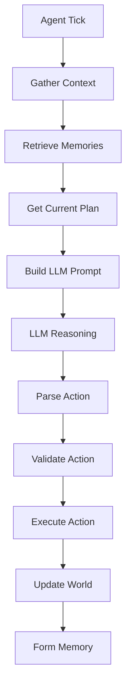

# Agent Behavior System

Technical documentation for the LLM-powered behavior system that enables authentic agent decision-making and action execution.

## 🎯 Overview

The Behavior System is responsible for translating agent cognitive state into concrete actions in the simulation world. It leverages Large Language Models to provide natural, personality-driven decision making that goes far beyond traditional rule-based AI.

### Key Innovation: Real LLM Reasoning

Instead of hard-coded decision trees, our agents use authentic AI reasoning:

```
❌ Traditional: if mood < 5: goto("social_area")
✅ Our System: "I'm feeling down today because I haven't had much 
               social interaction lately. As a cafe owner, I should 
               visit the community space to connect with people..."
```

## 🏗️ Architecture

### System Components

```
┌─────────────────────────────────────────┐
│           Behavior System               │
├─────────────────────────────────────────┤
│  🧠 LLM Decision Engine                 │
│     • Context building                  │
│     • Prompt engineering                │
│     • Response parsing                  │
├─────────────────────────────────────────┤
│  🎭 Action Execution                    │
│     • Action validation                 │
│     • World state updates              │
│     • Memory formation                  │
├─────────────────────────────────────────┤
│  🔄 Integration Layer                   │
│     • Memory system interface          │
│     • Planning system interface        │
│     • World manager interface          │
└─────────────────────────────────────────┘
```

### Core Files

- **`src/simulacra/simulation/llm_behavior.py`** - Main behavior engine
- **`src/simulacra/models/action.py`** - Action definitions and schemas
- **`src/simulacra/simulation/simulation_controller.py`** - Behavior integration

## 🧠 LLM Decision Engine

### Decision Process Flow



### Context Building

The system builds comprehensive context for LLM decision making:

```python
async def _build_agent_context(self, agent: Agent) -> Dict:
    """Build comprehensive context for decision making."""
    
    # Core agent state
    location = await self.world_manager.get_agent_location(agent.id)
    
    # Memory context - retrieve relevant experiences
    recent_memories = await self.memory_manager.get_recent_memories(
        agent.id, limit=5
    )
    relevant_memories = await self.memory_manager.query_memories(
        agent.id, 
        query=f"relevant to current situation at {location.name}",
        limit=3
    )
    
    # Planning context - current goals and tasks
    current_plan = None
    current_plan_task = None
    plan_goals = []
    
    if self.planning_engine:
        current_plan = await self.planning_engine.get_current_daily_plan(agent.id)
        if current_plan:
            plan_goals = current_plan.goals
            current_plan_task = await self.planning_engine.get_current_task(agent.id)
    
    # Environmental context
    nearby_agents = await self.world_manager.get_agents_at_location(location.id)
    available_connections = location.connections
    
    return {
        'agent': agent,
        'location': location,
        'nearby_agents': [a for a in nearby_agents if a.id != agent.id],
        'available_connections': available_connections,
        'recent_memories': recent_memories,
        'relevant_memories': relevant_memories,
        'current_plan': current_plan,
        'current_plan_task': current_plan_task,
        'plan_goals': plan_goals,
        'energy': agent.energy,
        'mood': agent.mood
    }
```

### Prompt Engineering

The system uses sophisticated prompt engineering to elicit natural reasoning:

```python
def _build_decision_prompt(self, agent: Agent, context: Dict) -> str:
    """Construct LLM prompt for decision making."""
    
    # Agent identity and personality
    agent_intro = f"""You are {agent.name}, a character in a social simulation.
    
PERSONALITY: {agent.personality}
BACKGROUND: {agent.bio}"""
    
    # Current situation
    situation = f"""
CURRENT SITUATION:
- Location: {context['location'].name} - {context['location'].description}
- Energy: {context['energy']}/100
- Mood: {context['mood']}/10"""
    
    # Social context
    social_context = ""
    if context['nearby_agents']:
        social_context = f"""
PEOPLE NEARBY:
{chr(10).join(f"- {agent.name}" for agent in context['nearby_agents'])}"""
    
    # Memory context
    memory_context = ""
    if context['recent_memories'] or context['relevant_memories']:
        memory_context = "\nRECENT EXPERIENCES:"
        for memory in context['recent_memories'][:3]:
            memory_context += f"\n- {memory.content}"
        
        if context['relevant_memories']:
            memory_context += "\n\nRELEVANT MEMORIES:"
            for memory in context['relevant_memories']:
                memory_context += f"\n- {memory.content}"
    
    # Planning context
    planning_context = ""
    if context['plan_goals']:
        planning_context = f"\nYour goals for today: {', '.join(context['plan_goals'])}\n"
    
    if context['current_plan_task']:
        task = context['current_plan_task']
        planning_context += f"Current planned task: {task.description}"
        if task.location:
            planning_context += f" (at {task.location})"
        planning_context += "\n"
    
    if planning_context:
        planning_context += "Consider how your planned activities align with what you want to do right now."
    
    # Available actions
    actions_context = f"""
AVAILABLE ACTIONS:
- move <location>: Move to a connected location ({', '.join(context['available_connections'])})
- wait: Stay in current location and observe
- observe: Look around and notice details
- interact <agent>: Interact with someone nearby (if anyone is present)"""
    
    # Decision prompt
    decision_prompt = f"""
What would you like to do next? Think about what this character would naturally want to do given their personality, current situation, social context, past experiences, and planned activities.

IMPORTANT: Respond with your reasoning followed by your chosen action in the format:
REASONING: [Your thought process]
ACTION: [action_type] [parameters if needed]

Example:
REASONING: I'm feeling energetic and want to check on my cafe business. I should head there to see how things are going.
ACTION: move cafe"""
    
    return f"{agent_intro}{situation}{social_context}{memory_context}{planning_context}{actions_context}{decision_prompt}"
```

### Response Parsing

The system parses LLM responses to extract reasoning and actions:

```python
def _parse_llm_response(self, response: str, available_actions: List[str]) -> Tuple[str, Optional[Dict]]:
    """Parse LLM response into reasoning and action."""
    
    try:
        lines = response.strip().split('\n')
        reasoning = ""
        action_dict = None
        
        for line in lines:
            line = line.strip()
            
            # Extract reasoning
            if line.startswith("REASONING:"):
                reasoning = line[10:].strip()
            
            # Extract action
            elif line.startswith("ACTION:"):
                action_text = line[7:].strip()
                action_dict = self._parse_action_text(action_text, available_actions)
        
        return reasoning, action_dict
        
    except Exception as e:
        logger.warning(f"Failed to parse LLM response: {e}")
        return "Thinking...", {"action_type": "wait"}

def _parse_action_text(self, action_text: str, available_actions: List[str]) -> Dict:
    """Parse action text into structured action."""
    
    parts = action_text.split()
    if not parts:
        return {"action_type": "wait"}
    
    action_type = parts[0].lower()
    
    # Validate action type
    if action_type not in available_actions:
        logger.warning(f"Invalid action type: {action_type}")
        return {"action_type": "wait"}
    
    # Parse parameters based on action type
    if action_type == "move" and len(parts) > 1:
        return {
            "action_type": "move",
            "target_location": parts[1]
        }
    
    elif action_type == "interact" and len(parts) > 1:
        return {
            "action_type": "interact",
            "target_agent": " ".join(parts[1:])
        }
    
    else:
        return {"action_type": action_type}
```

## 🎭 Action System

### Action Types

The system supports several core action types:

```python
class ActionType(Enum):
    MOVE = "move"
    WAIT = "wait"
    OBSERVE = "observe"
    INTERACT = "interact"

class Action(BaseModel):
    action_type: ActionType
    agent_id: str
    timestamp: datetime
    parameters: Dict[str, Any] = Field(default_factory=dict)
    reasoning: Optional[str] = None
    success: bool = True
    result_description: Optional[str] = None
```

### Action Execution

Each action type has specific execution logic:

#### Move Action

```python
async def execute_move_action(self, agent: Agent, target_location: str) -> ActionResult:
    """Execute agent movement to target location."""
    
    current_location = await self.world_manager.get_agent_location(agent.id)
    
    # Validate target location
    if target_location not in current_location.connections:
        return ActionResult(
            success=False,
            description=f"Cannot move to {target_location} from {current_location.name}",
            energy_cost=0
        )
    
    # Execute movement
    success = await self.world_manager.move_agent(agent.id, target_location)
    
    if success:
        new_location = await self.world_manager.get_location(target_location)
        return ActionResult(
            success=True,
            description=f"Moved from {current_location.name} to {new_location.name}",
            energy_cost=5,
            location_change=True
        )
    else:
        return ActionResult(
            success=False,
            description=f"Failed to move to {target_location}",
            energy_cost=1
        )
```

#### Interact Action

```python
async def execute_interact_action(self, agent: Agent, target_agent_name: str) -> ActionResult:
    """Execute social interaction between agents."""
    
    current_location = await self.world_manager.get_agent_location(agent.id)
    nearby_agents = await self.world_manager.get_agents_at_location(current_location.id)
    
    # Find target agent
    target_agent = None
    for nearby_agent in nearby_agents:
        if nearby_agent.name.lower() == target_agent_name.lower():
            target_agent = nearby_agent
            break
    
    if not target_agent:
        return ActionResult(
            success=False,
            description=f"Cannot find {target_agent_name} at {current_location.name}",
            energy_cost=1
        )
    
    # Generate interaction content using LLM
    interaction_content = await self._generate_interaction_content(agent, target_agent, current_location)
    
    # Create memories for both agents
    await self.memory_manager.add_memory(
        agent_id=agent.id,
        content=f"I interacted with {target_agent.name} at {current_location.name}. {interaction_content}",
        memory_type=MemoryType.ACTION,
        importance=await self._score_interaction_importance(agent, target_agent, interaction_content)
    )
    
    await self.memory_manager.add_memory(
        agent_id=target_agent.id,
        content=f"{agent.name} interacted with me at {current_location.name}. {interaction_content}",
        memory_type=MemoryType.OBSERVATION,
        importance=await self._score_interaction_importance(target_agent, agent, interaction_content)
    )
    
    return ActionResult(
        success=True,
        description=f"Interacted with {target_agent.name}: {interaction_content}",
        energy_cost=3,
        social_interaction=True
    )
```

#### Observe Action

```python
async def execute_observe_action(self, agent: Agent) -> ActionResult:
    """Execute environmental observation."""
    
    location = await self.world_manager.get_agent_location(agent.id)
    nearby_agents = await self.world_manager.get_agents_at_location(location.id)
    
    # Generate observation using LLM
    observation_prompt = f"""You are {agent.name} observing your environment.
    
Location: {location.name} - {location.description}
People present: {', '.join(a.name for a in nearby_agents if a.id != agent.id)}

What do you notice? Describe what catches your attention, considering your personality and current mood.
Keep it concise but meaningful."""
    
    observation = await self.llm_service.generate_text(observation_prompt)
    
    # Create observation memory
    await self.memory_manager.add_memory(
        agent_id=agent.id,
        content=f"I observed at {location.name}: {observation}",
        memory_type=MemoryType.OBSERVATION,
        importance=await self._score_observation_importance(agent, observation)
    )
    
    return ActionResult(
        success=True,
        description=f"Observed: {observation}",
        energy_cost=2,
        observation=True
    )
```

### Action Result Processing

```python
class ActionResult(BaseModel):
    success: bool
    description: str
    energy_cost: int = 0
    location_change: bool = False
    social_interaction: bool = False
    observation: bool = False
    metadata: Dict[str, Any] = Field(default_factory=dict)

async def process_action_result(self, agent: Agent, action: Action, result: ActionResult) -> None:
    """Process the results of an executed action."""
    
    # Update agent energy
    agent.energy = max(0, agent.energy - result.energy_cost)
    await self.storage.update_agent(agent)
    
    # Create action memory
    memory_content = f"I performed action '{action.action_type.value}'"
    if action.parameters:
        memory_content += f" with parameters: {action.parameters}"
    
    memory_content += f". Result: {result.description}"
    
    importance = await self._calculate_action_importance(agent, action, result)
    
    await self.memory_manager.add_memory(
        agent_id=agent.id,
        content=memory_content,
        memory_type=MemoryType.ACTION,
        importance=importance
    )
    
    # Log action for debugging and analysis
    self.sim_logger.log_agent_action(
        agent_name=agent.name,
        action_type=action.action_type.value,
        reasoning=action.reasoning,
        result=result.description,
        success=result.success
    )
```

## 🔄 Integration Points

### Memory System Integration

The behavior system creates and retrieves memories:

```python
# Memory formation after actions
await self.memory_manager.add_memory(
    agent_id=agent.id,
    content=action_description,
    memory_type=MemoryType.ACTION,
    importance=importance_score
)

# Memory retrieval for context
relevant_memories = await self.memory_manager.query_memories(
    agent.id,
    query="relevant to current situation",
    limit=5
)
```

### Planning System Integration

The behavior system considers current plans:

```python
# Get current plan and task
current_plan = await self.planning_engine.get_current_daily_plan(agent.id)
current_task = await self.planning_engine.get_current_task(agent.id)

# Include in decision context
planning_context = {
    'goals': current_plan.goals if current_plan else [],
    'current_task': current_task.description if current_task else None,
    'task_location': current_task.location if current_task else None
}
```

### World Manager Integration

The behavior system interfaces with world state:

```python
# Get world state
location = await self.world_manager.get_agent_location(agent.id)
nearby_agents = await self.world_manager.get_agents_at_location(location.id)

# Update world state
await self.world_manager.move_agent(agent.id, target_location)
await self.world_manager.update_agent_state(agent)
```

## 📊 Performance Optimization

### LLM Call Optimization

```python
# Batch LLM calls when possible
async def batch_agent_decisions(self, agents: List[Agent]) -> List[Action]:
    """Process multiple agent decisions in parallel."""
    
    tasks = []
    for agent in agents:
        task = asyncio.create_task(self.decide_action(agent))
        tasks.append(task)
    
    return await asyncio.gather(*tasks)

# Cache frequent contexts
@lru_cache(maxsize=100)
def get_cached_location_description(self, location_id: str) -> str:
    """Cache location descriptions to reduce redundant LLM calls."""
    return self.location_cache.get(location_id)
```

### Memory Retrieval Optimization

```python
# Limit memory queries for performance
recent_memories = await self.memory_manager.get_recent_memories(
    agent.id, 
    limit=5,  # Reasonable limit for context
    hours=6   # Recent timeframe
)

# Use efficient hybrid retrieval
relevant_memories = await self.memory_manager.query_memories(
    agent.id,
    query=context_query,
    limit=3,  # Keep context manageable
    min_importance=5.0  # Filter for important memories
)
```

## 🐛 Error Handling

### LLM Failure Recovery

```python
async def decide_action_with_fallback(self, agent: Agent) -> Action:
    """Decide action with graceful LLM failure handling."""
    
    try:
        # Primary: LLM-powered decision
        return await self.decide_action_llm(agent)
        
    except LLMTimeoutError:
        logger.warning(f"LLM timeout for {agent.name}, using fallback")
        return self._fallback_decision(agent)
        
    except LLMParsingError as e:
        logger.warning(f"LLM parsing error for {agent.name}: {e}")
        return self._safe_default_action(agent)
        
    except Exception as e:
        logger.error(f"Unexpected error in decision making for {agent.name}: {e}")
        return Action(
            action_type=ActionType.WAIT,
            agent_id=agent.id,
            reasoning="Recovering from error"
        )

def _fallback_decision(self, agent: Agent) -> Action:
    """Simple fallback decision without LLM."""
    
    # Basic personality-driven fallback
    if agent.energy < 30:
        return Action(action_type=ActionType.WAIT, agent_id=agent.id)
    elif agent.mood < 5:
        return self._seek_social_action(agent)
    else:
        return Action(action_type=ActionType.OBSERVE, agent_id=agent.id)
```

### Action Validation

```python
def validate_action(self, agent: Agent, action: Action) -> bool:
    """Validate action before execution."""
    
    # Check action type validity
    if action.action_type not in ActionType:
        return False
    
    # Validate move actions
    if action.action_type == ActionType.MOVE:
        target = action.parameters.get('target_location')
        if not target:
            return False
        
        current_location = self.world_manager.get_agent_location_sync(agent.id)
        if target not in current_location.connections:
            return False
    
    # Validate energy requirements
    energy_cost = self._get_action_energy_cost(action.action_type)
    if agent.energy < energy_cost:
        return False
    
    return True
```

## 📈 Monitoring and Analytics

### Decision Tracking

```python
class DecisionMetrics:
    def __init__(self):
        self.decision_count = 0
        self.action_distribution = defaultdict(int)
        self.success_rate = 0.0
        self.average_reasoning_length = 0.0
        self.llm_call_times = []
    
    def record_decision(self, action: Action, success: bool, reasoning_length: int, call_time: float):
        self.decision_count += 1
        self.action_distribution[action.action_type.value] += 1
        self.success_rate = (self.success_rate * (self.decision_count - 1) + (1 if success else 0)) / self.decision_count
        self.average_reasoning_length = (self.average_reasoning_length * (self.decision_count - 1) + reasoning_length) / self.decision_count
        self.llm_call_times.append(call_time)
```

### Behavior Analysis

```python
async def analyze_agent_behavior(self, agent_id: str, days: int = 7) -> BehaviorAnalysis:
    """Analyze agent behavior patterns over time."""
    
    # Get action history
    actions = await self.storage.get_agent_actions(
        agent_id, 
        since=datetime.now() - timedelta(days=days)
    )
    
    # Calculate metrics
    action_counts = defaultdict(int)
    location_visits = defaultdict(int)
    social_interactions = 0
    
    for action in actions:
        action_counts[action.action_type] += 1
        
        if action.action_type == ActionType.MOVE:
            location_visits[action.parameters.get('target_location')] += 1
        elif action.action_type == ActionType.INTERACT:
            social_interactions += 1
    
    return BehaviorAnalysis(
        total_actions=len(actions),
        action_distribution=dict(action_counts),
        most_visited_locations=dict(location_visits),
        social_interaction_rate=social_interactions / len(actions) if actions else 0,
        analysis_period_days=days
    )
```

## 🎯 Future Enhancements

### Planned Features

1. **Complex Actions**: Multi-step action sequences and goal-oriented behaviors
2. **Emotional Actions**: Actions that directly influence mood and relationships
3. **Object Interactions**: Rich interactions with world objects and tools
4. **Collaborative Actions**: Coordinated activities between multiple agents
5. **Learning Actions**: Actions that improve agent capabilities over time

### Research Directions

- Consistency analysis of LLM decision-making across time
- Personality expression validation through action patterns
- Social behavior emergence in multi-agent scenarios
- Action sequence optimization for goal achievement
- Real-time behavior adaptation based on feedback

---

The Behavior System represents the bridge between AI cognition and world action, enabling agents to express their personalities and pursue their goals through meaningful interactions with their environment and each other.
