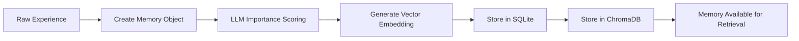

# Agent Memory System

Technical documentation for the episodic memory system that enables agents to remember, learn from, and retrieve past experiences with human-like memory characteristics.

## 🧠 Overview

The Memory System implements a sophisticated episodic memory architecture that allows agents to:

- **Remember everything**: Every action and observation becomes a persistent memory
- **Learn from experience**: Importance scoring helps prioritize significant events
- **Retrieve intelligently**: Hybrid search combines semantic similarity, recency, and importance
- **Build continuity**: Memories provide context for consistent personality and behavior

### Key Innovation: Hybrid Retrieval

Unlike simple chronological or keyword-based memory systems, our hybrid retrieval algorithm mimics human memory by balancing:

```
Memory Relevance = 0.6 × Semantic Similarity + 0.2 × Recency + 0.2 × Importance
```

This ensures agents recall the most contextually relevant experiences, not just the most recent ones.

## 🏗️ Architecture

### System Components

```
┌─────────────────────────────────────────┐
│            Memory System                │
├─────────────────────────────────────────┤
│  💾 Memory Formation Pipeline           │
│     • Experience capture                │
│     • Importance scoring (LLM)          │
│     • Embedding generation              │
│     • Dual storage (SQLite + Chroma)    │
├─────────────────────────────────────────┤
│  🔍 Hybrid Retrieval Engine             │
│     • Semantic search (ChromaDB)        │
│     • Recency weighting                 │
│     • Importance filtering              │
│     • Relevance scoring                 │
├─────────────────────────────────────────┤
│  🧮 Memory Analytics                    │
│     • Importance distribution           │
│     • Memory type analysis              │
│     • Retrieval performance             │
└─────────────────────────────────────────┘
```

### Core Files

- **`src/simulacra/agents/memory_manager.py`** - Main memory management logic
- **`src/simulacra/storage/sqlite_store.py`** - Structured data persistence  
- **`src/simulacra/storage/vector_store.py`** - Vector embeddings and semantic search
- **`src/simulacra/models/memory.py`** - Memory data models and schemas

## 💾 Memory Formation Pipeline

### Memory Creation Process



### Memory Data Model

```python
class Memory(BaseModel):
    id: str = Field(default_factory=lambda: str(uuid.uuid4()))
    agent_id: str
    content: str
    memory_type: MemoryType
    importance: float = Field(ge=0.0, le=10.0)
    timestamp: datetime = Field(default_factory=datetime.now)
    embedding: Optional[List[float]] = None
    metadata: Dict[str, Any] = Field(default_factory=dict)

class MemoryType(Enum):
    ACTION = "action"        # "I moved to the cafe"
    OBSERVATION = "observation"  # "I saw John at the garden"  
    REFLECTION = "reflection"    # "I crave community connections"
    PLANNING = "planning"        # "I planned to focus on creative work"
```

### Memory Formation Implementation

```python
async def add_memory(
    self,
    agent_id: str,
    content: str,
    memory_type: MemoryType,
    importance: Optional[float] = None,
    metadata: Optional[Dict[str, Any]] = None
) -> Memory:
    """Add new memory with importance scoring and embedding generation."""
    
    # Create memory object
    memory = Memory(
        agent_id=agent_id,
        content=content,
        memory_type=memory_type,
        metadata=metadata or {}
    )
    
    # Score importance using LLM if not provided
    if importance is None:
        agent = await self.storage.get_agent(agent_id)
        memory.importance = await self._score_memory_importance(agent, content)
    else:
        memory.importance = importance
    
    # Generate embedding for semantic search
    memory.embedding = await self.vector_store.generate_embedding(content)
    
    # Store in both databases
    await self.storage.add_memory(memory)
    await self.vector_store.add_memory(memory)
    
    logger.info(f"Added memory for {agent_id}: importance={memory.importance:.1f}")
    return memory
```

## 🎯 Importance Scoring System

### LLM-Powered Importance Evaluation

The system uses LLM reasoning to evaluate memory significance:

```python
async def _score_memory_importance(self, agent: Agent, memory_content: str) -> float:
    """Score memory importance using LLM evaluation."""
    
    prompt = f"""Rate the importance of this memory for {agent.name}:

Agent Profile:
- Name: {agent.name}
- Personality: {agent.personality}
- Background: {agent.bio}

Memory to evaluate: {memory_content}

Rate importance on a scale of 0-10:
• 0-2: Routine, mundane activity (walking, waiting, basic observations)
• 3-4: Moderate significance (regular social interactions, normal work)
• 5-6: Notable events (meaningful conversations, accomplishments, plans)
• 7-8: Important experiences (emotional moments, relationship changes, insights)
• 9-10: Life-changing events (major decisions, profound realizations, pivotal moments)

Consider:
- Emotional impact on the agent
- Relevance to agent's goals and personality
- Social significance and relationship impact
- Uniqueness or novelty of the experience
- Potential influence on future decisions

Return only the numeric score (0-10)."""

    try:
        response = await self.llm_service.generate_text(prompt)
        score = self._parse_importance_score(response)
        return max(0.0, min(10.0, score))  # Clamp to valid range
        
    except Exception as e:
        logger.warning(f"Failed to score memory importance: {e}")
        return 5.0  # Default moderate importance

def _parse_importance_score(self, response: str) -> float:
    """Extract numeric score from LLM response."""
    
    # Try to find numeric value in response
    import re
    numbers = re.findall(r'\d+\.?\d*', response.strip())
    
    if numbers:
        try:
            return float(numbers[0])
        except ValueError:
            pass
    
    # Fallback to keyword detection
    response_lower = response.lower()
    if any(word in response_lower for word in ['routine', 'mundane', 'basic']):
        return 2.0
    elif any(word in response_lower for word in ['important', 'significant']):
        return 7.0
    elif any(word in response_lower for word in ['life-changing', 'pivotal']):
        return 9.0
    else:
        return 5.0  # Default
```

### Importance Distribution Analysis

```python
class ImportanceStats:
    def __init__(self, memories: List[Memory]):
        self.total_memories = len(memories)
        self.average_importance = sum(m.importance for m in memories) / len(memories)
        self.importance_distribution = self._calculate_distribution(memories)
        self.high_importance_count = len([m for m in memories if m.importance >= 7.0])
        
    def _calculate_distribution(self, memories: List[Memory]) -> Dict[str, int]:
        distribution = {
            "routine (0-2)": 0,
            "moderate (3-4)": 0, 
            "notable (5-6)": 0,
            "important (7-8)": 0,
            "life-changing (9-10)": 0
        }
        
        for memory in memories:
            if memory.importance <= 2:
                distribution["routine (0-2)"] += 1
            elif memory.importance <= 4:
                distribution["moderate (3-4)"] += 1
            elif memory.importance <= 6:
                distribution["notable (5-6)"] += 1
            elif memory.importance <= 8:
                distribution["important (7-8)"] += 1
            else:
                distribution["life-changing (9-10)"] += 1
                
        return distribution
```

## 🔍 Hybrid Retrieval Engine

### Retrieval Algorithm

The core innovation of our memory system is the hybrid retrieval that balances multiple relevance factors:

```python
async def query_memories(
    self,
    agent_id: str,
    query: str,
    limit: int = 10,
    min_importance: float = 0.0,
    memory_types: Optional[List[MemoryType]] = None,
    time_weight: float = 0.2,
    importance_weight: float = 0.2,
    semantic_weight: float = 0.6
) -> List[Memory]:
    """Query memories using hybrid relevance scoring."""
    
    # Get candidate memories from vector search
    candidates = await self.vector_store.search_memories(
        agent_id=agent_id,
        query=query,
        limit=limit * 3,  # Over-fetch for re-ranking
        memory_types=memory_types
    )
    
    # Calculate hybrid relevance scores
    current_time = datetime.now()
    scored_memories = []
    
    for memory, semantic_similarity in candidates:
        if memory.importance < min_importance:
            continue
            
        # Calculate component scores
        semantic_score = semantic_similarity
        recency_score = self._calculate_recency_score(memory.timestamp, current_time)
        importance_score = memory.importance / 10.0  # Normalize to 0-1
        
        # Weighted combination
        relevance_score = (
            semantic_weight * semantic_score +
            time_weight * recency_score +
            importance_weight * importance_score
        )
        
        scored_memories.append((memory, relevance_score))
    
    # Sort by relevance and return top results
    scored_memories.sort(key=lambda x: x[1], reverse=True)
    return [memory for memory, score in scored_memories[:limit]]

def _calculate_recency_score(self, memory_time: datetime, current_time: datetime) -> float:
    """Calculate recency score using exponential decay."""
    
    # Time difference in hours
    time_diff_hours = (current_time - memory_time).total_seconds() / 3600
    
    # Exponential decay with 24-hour half-life
    DECAY_FACTOR = 24.0  # Hours for score to decay to 0.5
    recency_score = math.exp(-time_diff_hours / DECAY_FACTOR)
    
    return min(1.0, recency_score)  # Cap at 1.0
```

### Specialized Retrieval Methods

```python
async def get_recent_memories(
    self,
    agent_id: str,
    limit: int = 10,
    hours: int = 24,
    since: Optional[datetime] = None
) -> List[Memory]:
    """Get recent memories within time window."""
    
    if since is None:
        since = datetime.now() - timedelta(hours=hours)
    
    return await self.storage.get_recent_memories(
        agent_id=agent_id,
        limit=limit,
        since=since
    )

async def get_high_importance_memories(
    self,
    agent_id: str,
    min_importance: float = 7.0,
    limit: int = 20
) -> List[Memory]:
    """Get high-importance memories for reflection and planning."""
    
    return await self.storage.get_memories_by_importance(
        agent_id=agent_id,
        min_importance=min_importance,
        limit=limit
    )

async def get_memories_by_type(
    self,
    agent_id: str,
    memory_type: MemoryType,
    limit: int = 10
) -> List[Memory]:
    """Get memories of specific type (actions, observations, reflections)."""
    
    return await self.storage.get_memories_by_type(
        agent_id=agent_id,
        memory_type=memory_type,
        limit=limit
    )
```

## 🗄️ Storage Architecture

### Dual Storage System

The memory system uses a dual storage approach for optimal performance:

**SQLite (Structured Storage)**:
- Memory metadata and relationships
- Efficient filtering by time, importance, type
- ACID transactions for data consistency
- SQL queries for complex analysis

**ChromaDB (Vector Storage)**:
- Memory embeddings for semantic search
- Fast cosine similarity calculations
- Scalable vector indexing
- Efficient k-nearest neighbor search

### SQLite Schema

```sql
CREATE TABLE memories (
    id TEXT PRIMARY KEY,
    agent_id TEXT NOT NULL,
    content TEXT NOT NULL,
    memory_type TEXT NOT NULL,
    importance REAL NOT NULL,
    timestamp DATETIME NOT NULL,
    metadata TEXT,  -- JSON blob
    
    FOREIGN KEY (agent_id) REFERENCES agents (id),
    INDEX idx_agent_timestamp (agent_id, timestamp),
    INDEX idx_agent_importance (agent_id, importance),
    INDEX idx_agent_type (agent_id, memory_type)
);
```

### ChromaDB Integration

```python
class VectorStore:
    def __init__(self, collection_name: str = "agent_memories"):
        self.client = chromadb.PersistentClient(path="./data/chroma")
        self.collection = self.client.get_or_create_collection(
            name=collection_name,
            embedding_function=self._get_embedding_function()
        )
    
    async def add_memory(self, memory: Memory) -> None:
        """Add memory to vector store."""
        
        self.collection.add(
            documents=[memory.content],
            embeddings=[memory.embedding],
            metadatas=[{
                "agent_id": memory.agent_id,
                "memory_type": memory.memory_type.value,
                "importance": memory.importance,
                "timestamp": memory.timestamp.isoformat()
            }],
            ids=[memory.id]
        )
    
    async def search_memories(
        self,
        agent_id: str,
        query: str,
        limit: int = 10,
        memory_types: Optional[List[MemoryType]] = None
    ) -> List[Tuple[Memory, float]]:
        """Search memories using vector similarity."""
        
        # Build filter criteria
        where_clause = {"agent_id": agent_id}
        if memory_types:
            where_clause["memory_type"] = {"$in": [t.value for t in memory_types]}
        
        # Perform semantic search
        results = self.collection.query(
            query_texts=[query],
            n_results=limit,
            where=where_clause
        )
        
        # Convert results to Memory objects with similarity scores
        memories_with_scores = []
        for i, (doc_id, distance) in enumerate(zip(results['ids'][0], results['distances'][0])):
            similarity = 1.0 - distance  # Convert distance to similarity
            memory = await self._get_memory_by_id(doc_id)
            memories_with_scores.append((memory, similarity))
        
        return memories_with_scores
```

## 🔬 Memory Analytics

### Memory Distribution Analysis

```python
async def analyze_memory_patterns(self, agent_id: str, days: int = 7) -> MemoryAnalysis:
    """Analyze agent memory patterns over time."""
    
    since = datetime.now() - timedelta(days=days)
    memories = await self.get_recent_memories(agent_id, limit=1000, since=since)
    
    # Type distribution
    type_counts = defaultdict(int)
    for memory in memories:
        type_counts[memory.memory_type.value] += 1
    
    # Importance analysis
    importance_stats = ImportanceStats(memories)
    
    # Temporal patterns
    hourly_distribution = defaultdict(int)
    for memory in memories:
        hour = memory.timestamp.hour
        hourly_distribution[hour] += 1
    
    # Content analysis
    frequent_themes = await self._extract_memory_themes(memories)
    
    return MemoryAnalysis(
        total_memories=len(memories),
        memory_type_distribution=dict(type_counts),
        importance_statistics=importance_stats,
        hourly_activity_pattern=dict(hourly_distribution),
        frequent_themes=frequent_themes,
        analysis_period_days=days
    )

async def _extract_memory_themes(self, memories: List[Memory]) -> List[str]:
    """Extract common themes from memory content using LLM."""
    
    # Sample high-importance memories for theme extraction
    sample_memories = [m for m in memories if m.importance >= 6.0][:20]
    
    if not sample_memories:
        return []
    
    memory_texts = [m.content for m in sample_memories]
    
    prompt = f"""Analyze these memory excerpts and identify 5 main themes or patterns:

Memories:
{chr(10).join(f"- {text}" for text in memory_texts)}

Identify the top 5 recurring themes, topics, or patterns. Return as a simple list:
1. Theme name
2. Theme name
...etc"""
    
    response = await self.llm_service.generate_text(prompt)
    return self._parse_themes_from_response(response)
```

### Memory Quality Metrics

```python
class MemoryQualityMetrics:
    def __init__(self, memories: List[Memory]):
        self.memories = memories
        
    def calculate_diversity_score(self) -> float:
        """Calculate semantic diversity of memories."""
        if len(self.memories) < 2:
            return 0.0
            
        embeddings = [m.embedding for m in self.memories if m.embedding]
        if len(embeddings) < 2:
            return 0.0
        
        # Calculate pairwise similarities
        similarities = []
        for i in range(len(embeddings)):
            for j in range(i + 1, len(embeddings)):
                sim = cosine_similarity([embeddings[i]], [embeddings[j]])[0][0]
                similarities.append(sim)
        
        # Diversity is inverse of average similarity
        avg_similarity = sum(similarities) / len(similarities)
        return 1.0 - avg_similarity
    
    def calculate_importance_balance(self) -> float:
        """Calculate how well-balanced importance scores are."""
        importances = [m.importance for m in self.memories]
        
        if not importances:
            return 0.0
        
        # Check distribution across importance ranges
        ranges = [
            (0, 2),   # Routine
            (2, 5),   # Moderate  
            (5, 8),   # Notable
            (8, 10)   # Important
        ]
        
        range_counts = []
        for low, high in ranges:
            count = len([i for i in importances if low <= i < high])
            range_counts.append(count)
        
        # Calculate entropy (higher = more balanced)
        total = sum(range_counts)
        if total == 0:
            return 0.0
            
        entropy = 0.0
        for count in range_counts:
            if count > 0:
                p = count / total
                entropy -= p * math.log2(p)
        
        # Normalize to 0-1 scale
        max_entropy = math.log2(len(ranges))
        return entropy / max_entropy if max_entropy > 0 else 0.0
```

## 🚀 Performance Optimization

### Caching Strategies

```python
from functools import lru_cache
from typing import Dict, List, Tuple

class MemoryCache:
    def __init__(self, max_size: int = 1000):
        self.embedding_cache: Dict[str, List[float]] = {}
        self.recent_memories_cache: Dict[str, Tuple[datetime, List[Memory]]] = {}
        self.max_size = max_size
    
    @lru_cache(maxsize=100)
    def get_cached_embedding(self, content_hash: str) -> Optional[List[float]]:
        """Cache embeddings for identical content."""
        return self.embedding_cache.get(content_hash)
    
    def cache_recent_memories(self, agent_id: str, memories: List[Memory]) -> None:
        """Cache recent memory queries."""
        self.recent_memories_cache[agent_id] = (datetime.now(), memories)
    
    def get_cached_recent_memories(self, agent_id: str, max_age_minutes: int = 5) -> Optional[List[Memory]]:
        """Retrieve cached recent memories if still fresh."""
        if agent_id in self.recent_memories_cache:
            cache_time, memories = self.recent_memories_cache[agent_id]
            age = (datetime.now() - cache_time).total_seconds() / 60
            
            if age <= max_age_minutes:
                return memories
        
        return None
```

### Database Optimization

```python
# Optimized memory retrieval with database indexing
async def get_memories_optimized(
    self,
    agent_id: str,
    limit: int = 10,
    importance_threshold: float = 0.0,
    time_cutoff: Optional[datetime] = None
) -> List[Memory]:
    """Optimized memory retrieval using database indexes."""
    
    # Use indexes for efficient filtering
    query = """
    SELECT * FROM memories 
    WHERE agent_id = ? 
    AND importance >= ?
    """
    params = [agent_id, importance_threshold]
    
    if time_cutoff:
        query += " AND timestamp >= ?"
        params.append(time_cutoff)
    
    query += " ORDER BY importance DESC, timestamp DESC LIMIT ?"
    params.append(limit)
    
    return await self.storage.execute_query(query, params)

# Batch embedding generation
async def generate_embeddings_batch(self, contents: List[str]) -> List[List[float]]:
    """Generate embeddings in batches for efficiency."""
    
    BATCH_SIZE = 10
    embeddings = []
    
    for i in range(0, len(contents), BATCH_SIZE):
        batch = contents[i:i + BATCH_SIZE]
        batch_embeddings = await self.llm_service.generate_embeddings_batch(batch)
        embeddings.extend(batch_embeddings)
    
    return embeddings
```

## 🐛 Error Handling and Recovery

### Memory Corruption Recovery

```python
async def validate_and_repair_memories(self, agent_id: str) -> MemoryValidationReport:
    """Validate memory integrity and repair if possible."""
    
    report = MemoryValidationReport()
    
    # Get all memories for agent
    memories = await self.storage.get_all_memories(agent_id)
    
    for memory in memories:
        issues = []
        
        # Validate importance score
        if not (0.0 <= memory.importance <= 10.0):
            issues.append("Invalid importance score")
            memory.importance = max(0.0, min(10.0, memory.importance))
        
        # Validate embedding
        if memory.embedding is None:
            issues.append("Missing embedding")
            try:
                memory.embedding = await self.vector_store.generate_embedding(memory.content)
            except Exception as e:
                issues.append(f"Failed to regenerate embedding: {e}")
        
        # Validate content
        if not memory.content or len(memory.content.strip()) == 0:
            issues.append("Empty content")
            report.corrupted_memories.append(memory.id)
            continue
        
        if issues:
            report.repaired_memories.append((memory.id, issues))
            await self.storage.update_memory(memory)
    
    return report

class MemoryValidationReport:
    def __init__(self):
        self.corrupted_memories: List[str] = []
        self.repaired_memories: List[Tuple[str, List[str]]] = []
        self.total_validated: int = 0
```

### Graceful Degradation

```python
async def query_memories_with_fallback(
    self,
    agent_id: str,
    query: str,
    limit: int = 10
) -> List[Memory]:
    """Query memories with fallback to simpler methods if needed."""
    
    try:
        # Primary: Hybrid retrieval
        return await self.query_memories(agent_id, query, limit)
        
    except VectorStoreError:
        logger.warning("Vector store unavailable, falling back to keyword search")
        return await self._keyword_fallback_search(agent_id, query, limit)
        
    except Exception as e:
        logger.error(f"Memory query failed: {e}, using recent memories")
        return await self.get_recent_memories(agent_id, limit)

async def _keyword_fallback_search(self, agent_id: str, query: str, limit: int) -> List[Memory]:
    """Simple keyword-based search fallback."""
    
    keywords = query.lower().split()
    all_memories = await self.storage.get_recent_memories(agent_id, limit=100)
    
    scored_memories = []
    for memory in all_memories:
        content_lower = memory.content.lower()
        score = sum(1 for keyword in keywords if keyword in content_lower)
        
        if score > 0:
            scored_memories.append((memory, score))
    
    scored_memories.sort(key=lambda x: x[1], reverse=True)
    return [memory for memory, score in scored_memories[:limit]]
```

## 🎯 Future Enhancements

### Planned Features

1. **Memory Consolidation**: Automatic merging of similar memories to reduce redundancy
2. **Forgetting Mechanisms**: Gradual importance decay and selective memory deletion
3. **Episodic Clustering**: Grouping related memories into coherent episodes
4. **Cross-Agent Memory Sharing**: Shared memories for witnessed events
5. **Memory Compression**: Efficient storage of long-term memory patterns

### Research Directions

- Memory formation and retrieval validation against human memory research
- Optimal weighting factors for hybrid retrieval across different agent personalities
- Long-term memory evolution and personality development patterns
- Social memory phenomena and shared experience modeling
- Memory-driven learning and behavioral adaptation mechanisms

---

The Memory System forms the foundation of agent consciousness, enabling them to build rich inner lives based on accumulated experiences while maintaining computational efficiency and psychological realism.
